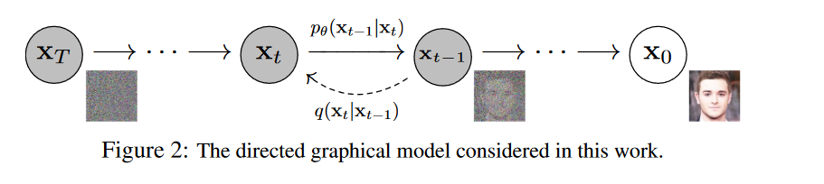
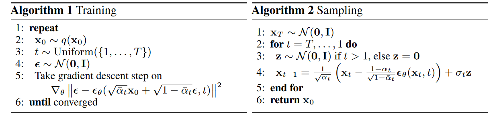

# Diffusion Models

[TOC]

注意：摘自[这个网站](https://lilianweng.github.io/posts/2021-07-11-diffusion-models/)还有[bilibili](https://www.bilibili.com/video/BV1b541197HX/?spm_id_from=333.880.my_history.page.click&vd_source=8a3baf666bc9210627c288b6ec6d567a)

Gererative Models:

- Seq2Seq
- Generative Adversarial Networks
- VAE: Variational Autoencoders
- Flow-based Models 数学模型比较严谨

这些模型在生成高质量的样本这个任务上很成功，但是每个模型都有自己的一些限制。

- GAN的训练不稳定而且容易产生模式崩塌，即生成的内容很单一
- VAE依赖surrogate loss
- Flow-models必须使用一个特殊的架构来构建可逆的变换

## Preliminary

### 1.条件概率

$$P(A,B,C) = P(C \vert B,A)P(B,A) = P(C\vert B,A)P(B\vert A)P(A)$$

$$P(B,C\vert A) = P(B\vert A) P(C\vert A,B)$$

上面两个公式都很容易从直觉上理解

### 2.基于马尔科夫假设的条件概率

假设有个马尔科夫链的关系A->B->C，而且在马尔科夫链中C与A无关，所以我们有
$$P(A,B,C) = P(C \vert B,A)P(B,A) = P(C\vert B)P(B\vert A)P(A)$$

这里我们与上面不同的是$P(C\vert B)$少了个$A$

### 3.Kullback-Leibler（KL） Divergence

摘自[知乎 kl divergence 的介绍](https://zhuanlan.zhihu.com/p/100676922)

KL散度是比较两个概率分布之间的差距的一个指标，不是距离，不是距离。

- 熵
  
    $$
    H = - \sum_{i=1}^N p(x_i) \log p(x_i)
    $$

    熵可以解释为“我们编码信息所需要的最小比特数”，在这里我们一般使用$\log_2$

- KL散度
    熵的关键在于，我们只需要知道所需位数的理论下限，就可以准确地量化数据中心有多少信息。现在我们可以地刺进行量化，当我们将观察到的分布替换成参数化的近似值的时候，我们丢失了多少信息呢。
    $$
    \begin{aligned}
    D_{KL} &=\sum_{i=1}^N p(x_i)(\log p(x_i) - \log q(x_i))\\
    &= \sum_{i=1}^N p(x_i)(\log \frac{p(x_i)}{q(x_i)})\\
    &= \mathbb{E}_{x_i \sim p(x_i)}[\log p(x_i) - \log q(x_i)]
    \end{aligned}
    $$

    利用KL，散度，我们可以精确地计算出我们近似一个分布与另一个分布的时候损失了多少信息。

- KL散度不是距离
    KL散度它并不是距离，因为
    $$
    D_{KL}(p \vert\vert q) \not =D_{KL}(q \vert\vert p)
    $$
    他两并不是对称的

### 4.Kullback-Leibler（KL） Divergence of Gaussian Distribution

对于两个单一变量的高斯分布$p,q$而言，他们的KL散度为

参照[CSDN](https://blog.csdn.net/hegsns/article/details/104857277)

$$
\begin{aligned}
D_{KL}(p,q) &= \int p(x_i)(\log \frac{p(x_i)}{q(x_i)})\\
&= \int \frac{1}{\sigma_1 \sqrt{2 \pi}} e^{- \frac{(x-\mu_1)^2}{2\sigma_1^2}}\left(\log \frac{\frac{1}{\sigma_1 \sqrt{2 \pi}} e^{- \frac{(x-\mu_1)^2}{2\sigma_1^2}}}{\frac{1}{\sigma_2 \sqrt{2 \pi}} e^{- \frac{(x-\mu_2)^2}{2\sigma_2^2}}}\right)dx\\
&=\int \frac{1}{\sigma_1 \sqrt{2 \pi}} e^{- \frac{(x-\mu_1)^2}{2\sigma_1^2}} \left [\log \frac{\sigma_2}{\sigma_1}- \frac{(x-\mu_1)^2}{2\sigma_1^2}+ \frac{(x-\mu_2)^2}{2\sigma_2^2} \right] dx\\
&= \underbrace{\int \frac{1}{\sigma_1 \sqrt{2 \pi}} e^{- \frac{(x-\mu_1)^2}{2\sigma_1^2}}\log \frac{\sigma_2}{\sigma_1} dx}_{积分为1}- \underbrace{\int \frac{1}{\sigma_1 \sqrt{2 \pi}} e^{- \frac{(x-\mu_1)^2}{2\sigma_1^2}}\frac{(x-\mu_1)^2}{2\sigma_1^2}dx}_{方差}+\underbrace{\int \frac{1}{\sigma_1 \sqrt{2 \pi}} e^{- \frac{(x-\mu_1)^2}{2\sigma_1^2}}\frac{(x-\mu_2)^2}{2\sigma_2^2}dx}_{展开之后是均方值、均值、常数}\\
&= \log \frac{\sigma_2}{\sigma_1} + \frac{\sigma_1^2 + (\mu_1 - \mu_2)^2}{2\sigma_2^2} - \frac{1}{2}\\
\end{aligned}
$$

### 5.Reparameterize

如果从高斯分布$N(\mu,\sigma^2)$中采样，我们$\mu,\sigma$是网络输出，采样导致梯度不能传播，所以我们要使用重参数。

具体方法是先从标准分布$N(0,1)$中采样出$z$，再使用$\sigma*z+\mu$这样使随机性转移到了$z$这个变量上去了，这样梯度得以传播。

在VAE和Diffusion中大量使用，当然在我强化学习仓库中的SAC中也用到了Reparameterize的技巧。

### 6.VAE

- Variational Auto Encoder
  
  单层VAE及其置信下界

  x是由隐变量z生成的，我们使用后验网络$\phi$来从x预测z，然后在预测过程中直接使用z来生成x
  x->z : $q_\phi (z \vert x)$
  z->x : $p_\theta(x \vert z)$

  $$
  p(x) = \int_z p_\theta(x \vert z)p(z)\\
  p(x) = \int q_\phi(z \vert x) \frac{p_\theta(x \vert z)p(z)}{q_\phi(z \vert x)}\\
  p(x) = \mathbb{E}_{z \sim q_\phi (z \vert x)}\left [\frac{p_\theta(x \vert z)p(z)}{q_\phi(z \vert x)}\right]\\
  \log p(x) = \log \mathbb{E}_{z \sim q_\phi (z \vert x)}\left [\frac{p_\theta(x \vert z)p(z)}{q_\phi(z \vert x)}\right]\\
  \log p(x) \ge\mathbb{E}_{z \sim q_\phi (z \vert x)}\left [\log \frac{p_\theta(x \vert z)p(z)}{q_\phi(z \vert x)}\right] (Jasen \ inequality)
  $$

    最大化最大似然$\log p(x)$也就是最大化这个下界，右边中括号中是一个KL散度，假设它们都符合高斯分布，那么高斯分布之间的KL散度是可以解的，所以我们得以进行最小化
- Multi-layer VAE

    对于多层VAE来说，我们照葫芦画瓢，得到损失函数为
    $$
    \mathcal{L}(\theta,\phi) = \mathbb{E}_{z_1,z_2 \sim q(z_1,z_2\vert x)}[\log p(x\vert z_1) - \log q(z_1 \vert x) + \log p(z_1 \vert z_2) - \log q(z_2 \vert z_1) + \log p(z_2)]
    $$

## Diffusion Model图示

$x_0$是目标分布，$x_T$是噪声分布，从右到左是熵增的过程，也叫扩散过程，从左到右是逆扩散（reverse）过程。

我们的终极目的是将$x_T \to x_0$的过程给弄明白，这样我们生成一个噪声，就可以得到一个图片了。当然在推理过程中只用到逆扩散。

## Diffusion 扩散过程（正向）

- 正向过程中**不含可训练参数**
- 给定初始数据分布$x_0 \sim q(x)$，我们往里面不断地添加高斯噪声，标准差是一个定值$\beta_t$，均值是$\beta_t$和当前的数据$x_t$决定的，这个过程是一个**马尔科夫链**。
- 随着$t$的不断增大，我们的最终分布$x_T$变成了一个**各项独立的高斯分布**。
    $$
    q(x_t \vert x_{t-1}) = \mathcal{N}(x_t ; \sqrt{1-\beta_t} x_{t-1},\beta_t \mathbf{I})\\
    q(x_{1:T} \vert x_0)= \prod_{t=1}^Tq(x_t \vert x_{t-1})
    $$

    其中$\{\beta_t \in (0,1)\}_{t=1}^T$，可以看到$x_t$只与上一时刻有关，因为它是上一次的x加个噪声得来的。

    $\beta_t,T$都是超参数，正向过程中不包含可训练参数

    当$T\to \infty$的时候，$x_T$就是一个各项独立的高斯分布（**Isotropic**）
- 任意时刻的$q(x_t)$是可以推导出来的，不需要进行迭代计算

    令$ \alpha_t = 1-\beta_t,\bar{\alpha}_t = \prod_{i=1}^T \alpha_i$
    $$
    \begin{aligned}
    x_t &= \sqrt{\alpha_t}x_{t-1} + \sqrt{1-\alpha_t}z_{t-1},z \sim \mathcal{N}(0,\mathbf{I})\\
    &= \sqrt{\alpha_t}(\sqrt{\alpha_{t-1}}x_{t-2} + \sqrt{1-\alpha_{t-1}}z_{t-2}) + \sqrt{1-\alpha_t}z_{t-1}\\
    &=\sqrt{\alpha_t \alpha_{t-1}}x_{t-2} + \sqrt{\alpha_t-\alpha_t \alpha_{t-1}}z_{t-2}+\sqrt{1-\alpha_t}z_{t-1}\\
    &=\sqrt{\alpha_t \alpha_{t-1}}x_{t-2} + \sqrt{1-\alpha_t \alpha_{t-1}}\bar{z}_{t-2}\\
    &= \dots\\
    &= \sqrt{\bar{a}_t}x_0 + \sqrt{1-\bar{a}_t}z
    \end{aligned}
    $$

  - 第一步使用[重参数技巧](#5reparameterize)，$\sigma*z+\mu$，其中$z \sim \mathcal{N}(0,\mathbf{I})$

  - 第三四步使用了两个高斯分布的叠加，$X\sim N(\mu_1,\sigma_1),Y \sim N(\mu_2,\sigma_2)$,$aX+bY \sim N(a\mu_1+b\mu_2, a^2\sigma_1^2+b^2\sigma_2^2)$

  - 所以我们有$q(x_t \vert x_0) = \mathcal{N} (x_t;\sqrt{\bar{a}_t}x_0,\sqrt{1-\bar{a}_t}\mathbf{I})$

  - 一般来说，随着$t$的增加，我们的x的噪声就变得更多，可以让步子变大一点，$\beta_1 \lt \beta_2 \lt \dots \lt \beta_T$，因此$\bar{\alpha}_1 \gt \bar{\alpha}_2 \gt \dots \gt \bar{\alpha}_T$

## Diffusion Model 逆扩散过程（逆向）

- 逆过程也叫重建(reconstruction)，期望从原始的高斯分布中恢复我们的目标分布。逆扩散过程是一个马尔科夫链过程。

- 如果我们可以逆转上述的扩散过程并从$q(x_{t-1} \vert x_t)$中采样，我们就可以从高斯噪声$x_T \sim \mathcal{N}(0,\mathbf{I})$中恢复原始分布。$\beta_t$如果足够小的话，$q(x_{t-1} \vert x_t)$也是高斯分布。

- 不幸的是，我们不能很轻易的估计$q(x_{t-1} \vert x_t)$，因为它需要遍历整个数据集，所以我们使用万能的神经网络来做这个事情，这样我们就也可以进行逆向操作了。

    $$
    p_\theta(x_{0:T}) = p(x_T) \prod_{t=1}^T p_\theta(x_{t-1} \vert x_t) \\
    p_\theta(x_{t-1} \vert x_t)=\mathcal{N}(x_{t-1}; \mu_\theta(x_t,t),\sigma_\theta(x_t,t))
    $$

- 在实验中，作者将方差$\sigma_\theta(x_t,t)$设置为常量，即：
    $$
    \sigma_\theta(x_t,t) = \sigma_t^2 \mathbf{I}\\
    \sigma_t^2 = \tilde{\beta}_t =1/(\frac{\alpha_t}{\beta_t} + \frac{1}{1-\bar{\alpha}_{t-1}})= \frac{1-\bar{\alpha}_{t-1}}{1-\bar{\alpha}_t}\cdot \beta_t
    $$

- 扩散的后验概率分布是可以用公式来计算的-$q(x_{t-1}\vert x_t , x_0)$

    给定 $x_t,x_0$，我们可以计算出$x_{t-1}$

    $$q(x_{t-1}\vert x_t , x_0) = \mathcal{N} (x_{t-1};\tilde{\mu}(x_t,x_0),\tilde{\beta}_t \mathbf{I})$$

    根据贝叶斯公式$P(A\vert B) = P(B \vert A) \frac{P(A)}{P(B)}$，有：
    $$
    \begin{aligned}
    q(x_{t-1}\vert x_t,x_0) &= q(x_t \vert x_{t-1},x_0)\frac{q(x_{t-1} \vert x_0)}{q(x_t \vert x_0)}\\
    &\propto \exp\left(-\frac{1}{2}\left(\frac{(x_t - \sqrt{\alpha_t} x_{t-1})^2}{\beta_t}+\frac{(x_{t-1} - \sqrt{\bar{\alpha}_{t-1}} x_0)^2}{1-\bar{\alpha}_{t-1}}+\frac{(x_t - \sqrt{\bar{\alpha}_{t}} x_0)^2}{1-\bar{\alpha}_{t}}\right) \right)\\
    &=\exp \left (-\frac{1}{2}\left((\frac{\alpha_t}{\beta_t} + \frac{1}{1-\bar{\alpha}_{t-1}}) x_{t-1}^2 - (\frac{2\sqrt{\alpha_t}}{\beta_t}x_t + \frac{2\sqrt{\bar{\alpha}_{t-1}}}{1-\bar{\alpha}_{t-1}}x_0)x_{t-1} + \underbrace{C(x_t,x_0)}_{与x_{t-1}无关的项}   \right) \right)
    \end{aligned}
    $$
    第三个等式把第二个propto变成了$y= ax^2 +bx +c$的形式，中轴线就是$-\frac{2a}{b}$，那么可以知道高斯分布的方差和均值了。

    $$
    \begin{aligned}
    \tilde{\beta}_t &=1/(\frac{\alpha_t}{\beta_t} + \frac{1}{1-\bar{\alpha}_{t-1}})= \frac{1-\bar{\alpha}_{t-1}}{1-\bar{\alpha}_t}\cdot \beta_t\\
    \tilde{\mu}(x_t,x_0)&=(\frac{\sqrt{\alpha_t}}{\beta_t}x_t + \frac{\sqrt{\bar{\alpha}_{t-1}}}{1-\bar{\alpha}_{t-1}}x_0)/(\frac{\alpha_t}{\beta_t} + \frac{1}{1-\bar{\alpha}_{t-1}})\\
    &=(\frac{\sqrt{\alpha_t}}{\beta_t}x_t + \frac{\sqrt{\bar{\alpha}_{t-1}}}{1-\bar{\alpha}_{t-1}}x_0)\frac{1-\bar{\alpha}_{t-1}}{1-\bar{\alpha}_t}\cdot \beta_t\\
    &=\frac{\sqrt{\alpha_t}(1-\bar{\alpha}_{t-1})}{1-\bar{\alpha}_t}x_t + \frac{\sqrt{\alpha_{t-1}}\beta_t}{1-\bar{\alpha}_t}x_0\\
    \end{aligned}
    $$
    我们从正向过程中可以得到：
    $$
    x_0 = \frac{1}{\sqrt{\bar{\alpha}}_t}(x_t - \sqrt{1-\bar{\alpha}_t}z_t)
    $$
    代入上面式子：
    $$
    \begin{aligned}
    \tilde{\mu}(x_t,x_0)&=\frac{\sqrt{\alpha_t}(1-\bar{\alpha}_{t-1})}{1-\bar{\alpha}_t}x_t + \frac{\sqrt{\alpha_{t-1}}\beta_t}{1-\bar{\alpha}_t}\frac{1}{\sqrt{\bar{\alpha}}_t}(x_t - \sqrt{1-\bar{\alpha}_t}z_t)\\
    &=\frac{1}{\sqrt{\alpha_t}}\left( x_t - \frac{\beta_t}{\sqrt{1-\bar{\alpha}_t}}z_t\right)
    \end{aligned}
    $$

## 目标分布的似然函数

- 我们最终是要优化的是nllloss，也就是negative log likelihood loss（负对数似然损失）,我们要想个办法去求它的上界，曲线救国一下。
  
  下面式子中$q$是正向的扩散，$p_\theta$是逆扩散的估计网络，它具有参数$\theta$
    $$
    \begin{aligned}
    -\log p_\theta(x_0) &\le -\log p_\theta(x_0) + D_{KL}(q(x_{1:T}\vert x_0)\vert\vert p_\theta(x_{1:T}\vert x_0)) \\
    &=-\log p_\theta(x_0) +\mathbb{E}_{x_{1:T}\sim q(x_{1:T})}\left[ \log \frac{q(x_{1:T}\vert x_0)}{\underbrace{p_\theta(x_{0:T})/p_\theta(x_0)}_{这里用到了条件概率}}\right]\\
    &=-\log p_\theta(x_0)+ \mathbb{E}_{x_{0:T}\sim q(x_{0:T})}\left[ \log \frac{q(x_{1:T}\vert x_0)}{p_\theta(x_{0:T})}+ \log p_\theta(x_0)\right]\\
    &= \mathbb{E}_{x_{0:T}\sim q(x_{0:T})}\left[ \log \frac{q(x_{1:T}\vert x_0)}{p_\theta(x_{0:T})}\right]
    \end{aligned}
    $$

    $$
    L_{VLB} = \mathbb{E}_{x_{0:T}\sim q(x_{0:T})}\left[ \log \frac{q(x_{1:T}\vert x_0)}{p_\theta(x_{0:T})}\right] \ge \underbrace{- \mathbb{E}_{x_0 \sim q(x_0)} \log p_\theta (x_0)}_{这个就是交叉熵}
    $$

- $L_{VLB}$就是交叉熵的上界，然后我们还需要对交叉熵上界进行化简：

    注意：
    $$
    \begin{aligned}
    q(x_t\vert x_{t-1}) &= q(x_t\vert x_{t-1},x_0)\\
    &=\frac{q(x_t,x_{t-1},x_0)}{q(x_{t-1},x_0)}（条件概率公式）\\
    &=\frac{q(x_{t-1}\vert x_t,x_0)q(x_t \vert x_0)q(x_0)}{q(x_{t-1},x_0)}\\
    &=\frac{q(x_{t-1}\vert x_t,x_0)q(x_t \vert x_0)}{q(x_{t-1}\vert x_0)}(上下都除以一个q(x_0))
    \end{aligned}
    $$

    正式开始化简：
    $$
    \begin{aligned}
    \mathbb{E}_{x_{0:T}\sim q(x_{0:T})}\left[ \log \frac{q(x_{1:T}\vert x_0)}{p_\theta(x_{0:T})}\right]&=\mathbb{E}_{q}\left [\log \frac{\prod_{t=1}^T q(x_t\vert x_{t-1})}{p(x_T) \prod_{t=1}^T p_\theta(x_{t-1} \vert x_t)} \right]\\
    &= \mathbb{E}_{q}\left [-\log p(x_T)+\log \frac{\prod_{t=1}^T q(x_t\vert x_{t-1})}{ \prod_{t=1}^T p_\theta(x_{t-1} \vert x_t)} \right]\\
    &=\mathbb{E}_{q}\left [-\log p(x_T)+\sum_{t=1}^T\log \frac{ q(x_t\vert x_{t-1})}{  p_\theta(x_{t-1} \vert x_t)} \right]\\
    &= \mathbb{E}_{q}\left [-\log p(x_T)+\sum_{t=2}^T\log \frac{ q(x_t\vert x_{t-1})}{  p_\theta(x_{t-1} \vert x_t)}+\log \frac{q(x_1\vert x_0)}{p(x_0\vert x_1)} \right]\\
    &=\mathbb{E}_{q}\left [-\log p(x_T)+\sum_{t=2}^T\log \underbrace{\left(\frac{ q(x_{t-1}\vert x_t,x_0)}{  p_\theta(x_{t-1} \vert x_t)}\cdot \frac{q(x_t \vert x_0)}{q(x_{t-1}\vert x_0)}\right)}_{这里用到了上面的q(x_t\vert x_{t-1})的推导}+\log \frac{q(x_1\vert x_0)}{p(x_0\vert x_1)} \right]\\
    &= \mathbb{E}_{q}\left [-\log p(x_T)+\sum_{t=2}^T\log \left(\frac{ q(x_{t-1}\vert x_t,x_0)}{  p_\theta(x_{t-1} \vert x_t)}\right)+\sum_{t=2}^T\log \left( \frac{q(x_t \vert x_0)}{q(x_{t-1}\vert x_0)}\right)+\log \frac{q(x_1\vert x_0)}{p(x_0\vert x_1)} \right]\\
    &=\mathbb{E}_{q}\left [-\log p(x_T)+\sum_{t=2}^T\log \left(\frac{ q(x_{t-1}\vert x_t,x_0)}{  p_\theta(x_{t-1} \vert x_t)}\right)+\log \frac{q(x_T\vert x_0)}{q(x_{1}\vert x_0)}+\log \frac{q(x_1\vert x_0)}{p(x_0\vert x_1)} \right]\\
    &=\mathbb{E}_{q}\left [\log \frac{q(x_T\vert x_0)}{p(x_T)}+\sum_{t=2}^T\log \left(\frac{ q(x_{t-1}\vert x_t,x_0)}{  p_\theta(x_{t-1} \vert x_t)}\right)-\log p_\theta(x_0\vert x_1) \right]\\
    &= \mathbb{E}_q\left [\underbrace{D_{KL}(q(x_T\vert x_0) \vert\vert p_\theta(x_T))}_{L_T}+\sum_{t=2}^T \underbrace{D_{KL}(q(x_{t-1}\vert x_t,x_0) \vert \vert p_\theta(x_{t-1} \vert x_t))}_{L_{t-1}} \underbrace{- \log p_\theta(x_0\vert x_1)}_{L_0} \right]
    \end{aligned}
    $$

    在这里作者将$p_\theta(x_{t-1}\vert x_t)$的方差设置为一个常数，与$\beta$相关，可训练的参数只存在于均值中。

    下面我们要用到：
    $D_{KL}(p,q)= \log \frac{\sigma_2}{\sigma_1} + \frac{\sigma_1^2 + (\mu_1 - \mu_2)^2}{2\sigma_2^2} - \frac{1}{2}$

    $$
    L_{t-1} = \mathbb{E}_q\left[\frac{1}{2\sigma_t^2 }\vert\vert \tilde{\mu}_t (x_t,x_0)-\mu_\theta(x_t,t)\vert\vert^2 \right]+C
    $$

    $$
    \begin{aligned}
    L_{t-1}-C &=\mathbb{E}_q\left[\frac{1}{2\sigma_t^2 }\vert\vert \tilde{\mu}_t (x_t,x_0)-\mu_\theta(x_t,t)\vert\vert^2 \right]\\
    &=\mathbb{E}_{x_0,\epsilon}\left[\frac{1}{2\sigma_t^2 }\vert\vert \tilde{\mu}_t (x_t(x_0,\epsilon),\frac{1}{\sqrt{\bar{\alpha}}_t}(x_t - \sqrt{1-\bar{\alpha}_t}\epsilon))-\mu_\theta(x_t(x_0,\epsilon),t)\vert\vert^2 \right]
    \end{aligned}
    $$

    又因为我们上面推出来了$\tilde{\mu}_t$，我们代进去(**注意这里的$\epsilon$就是我们的随机高斯噪声$z$**)：

    $$
    \begin{aligned}
    \mathbb{E}_{x_0,\epsilon}\left[\frac{1}{2\sigma_t^2 }\vert\vert \tilde{\mu}_t (x_t(x_0,\epsilon),\frac{1}{\sqrt{\bar{\alpha}}_t}(x_t - \sqrt{1-\bar{\alpha}_t}\epsilon))-\mu_\theta(x_t(x_0,\epsilon),t)\vert\vert^2 \right]=
    \mathbb{E}_{x_0,\epsilon}\left[\frac{1}{2\sigma_t^2 }\vert\vert \frac{1}{\sqrt{\alpha_t}}\left( x_t(x_0,\epsilon) - \frac{\beta_t}{\sqrt{1-\bar{\alpha}_t}}\epsilon\right)-\mu_\theta(x_t(x_0,\epsilon),t)\vert\vert^2 \right]
    \end{aligned}
    $$

    在这里我们需要$\mu_\theta$尽可能地去逼近$\tilde{\mu}$，我们可以有多种建模目标
  - 可以直接输出$\tilde{\mu}(x_t,x_0)$
  - 预测$x_0$，这种做法一步到位，效果差，需要经过马尔科夫高斯条件迭代来生成最终高质量的样本
  - 预测噪声$\epsilon$，**作者采取这种方法**

    所以我们有：
    $$
    \mu_\theta(x_t,t) = \tilde{\mu}_t (x_t,\frac{1}{\sqrt{\bar{\alpha}}_t}(x_t - \sqrt{1-\bar{\alpha}_t}\epsilon_\theta(x_t,t)))=\frac{1}{\sqrt{\alpha_t}}\left( x_t - \frac{\beta_t}{\sqrt{1-\bar{\alpha}_t}}\epsilon_\theta(x_t,t)\right)
    $$

    再代入上面的式子得到
    $$
    \begin{aligned}
    &\mathbb{E}_{x_0,\epsilon}\left[\frac{1}{2\sigma_t^2 }\vert\vert \frac{1}{\sqrt{\alpha_t}}\left( x_t(x_0,\epsilon) - \frac{\beta_t}{\sqrt{1-\bar{\alpha}_t}}\epsilon\right)-\mu_\theta(x_t(x_0,\epsilon),t)\vert\vert^2 \right]\\
    &=\mathbb{E}_{x_0,\epsilon}\left[\frac{1}{2\sigma_t^2 }\vert\vert \frac{1}{\sqrt{\alpha_t}}\left( x_t(x_0,\epsilon) - \frac{\beta_t}{\sqrt{1-\bar{\alpha}_t}}\epsilon\right)-\frac{1}{\sqrt{\alpha_t}}\left( x_t - \frac{\beta_t}{\sqrt{1-\bar{\alpha}_t}}\epsilon_\theta(x_t,t)\right)\vert\vert^2 \right]\\
    &=\mathbb{E}_{x_0,\epsilon}\left[\frac{\beta_t^2}{2\sigma_t^2\alpha_t (1-\bar{\alpha}_t) }\vert\vert \epsilon - \epsilon_\theta(\sqrt{\bar{a}_t}x_0 + \sqrt{1-\bar{a}_t}\epsilon,t)\vert\vert^2\right]
    \end{aligned}
    $$

    这样，我们的网络的输入就是$（x_0,t）$，输出就是第$t$步高斯噪声的预测
    完全可以去掉前面那一坨分数得到简化形式：
    $$
    L_{simple}(\theta)=\mathbb{E}_{x_0,\epsilon}\left[\vert\vert \epsilon - \epsilon_\theta(\sqrt{\bar{a}_t}x_0 + \sqrt{1-\bar{a}_t}\epsilon,t)\vert\vert^2\right]
    $$

    我们终于得到了优化的目标！可喜可贺。

## 算法完整步骤

## 代码实现

请移步至该文件夹的代码部分
